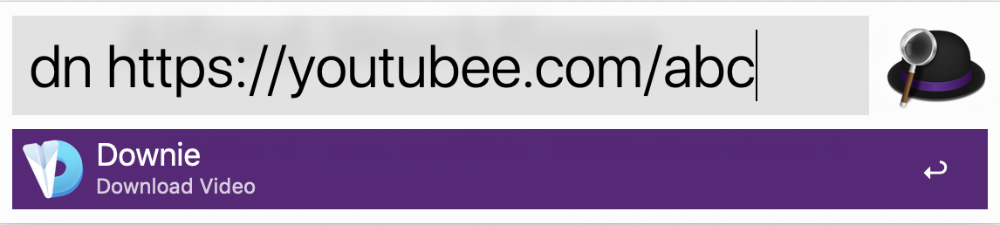
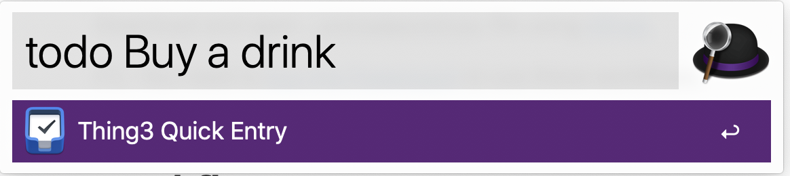

# Alfred-Workflows

A collection of  [Alfred](https://www.alfredapp.com/) workflows. *(Tested only in version 3)*

## Installation

Download and open `.alfredworkflow` file using [Alfred.](https://www.alfredapp.com/)

P.S.: You need to [buy the Powerpack](https://buy.alfredapp.com/) to use these workflows.

## Workflows

#### Downie [download](https://github.com/Zrocky/Alfred-Workflows/raw/master/Downie.alfredworkflow)

*Use [Downie](https://software.charliemonroe.net/downie/) app save video from the Internet .*

You can enter a video link in the command box or save the link directly to the clipboard and press Enter.

#### Things3 Quick Entry [download](https://github.com/Zrocky/Alfred-Workflows/raw/master/Thing3%20Quick%20Entry.alfredworkflow)

Quickly create [Things](https://culturedcode.com/things/) to do.

## License

[GPL-3.0 license](https://github.com/Zrocky/Alfred-Workflows/blob/master/LICENSE)

